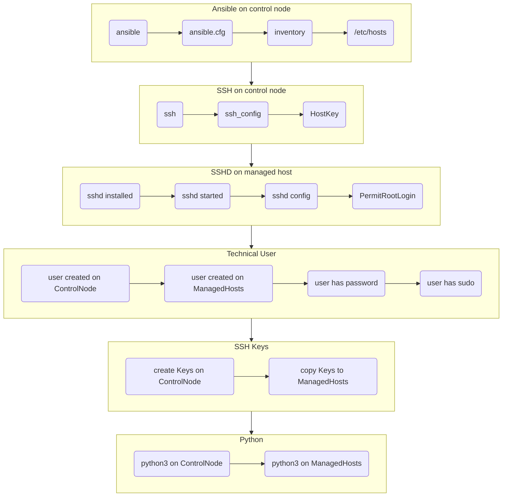

# Section 2. Troubleshooting Ansible Configuration

### In this section the following subjects will be covered:

1. Summary of setting up Ansible
1. Exercise for pairs of participants
1. Validation process for Ansible configuration

---
## Summary of setting up Ansible

- [ ] Network connectivity from Control Node to Managed Hosts
- [ ] Install Ansible on Control Node
- [ ] Install Python3 on all Nodes
- [ ] Create technical user on all Nodes
- [ ] Create password for technical user
- [ ] Grant sudo for technical user
- [ ] Create SSH Key for technical user on Control Node
- [ ] Copy SSH Key from Control Node to all Managed Hosts
- [ ] Create some ./inventory
- [ ] Optionally create some ./ansible.cfg
- [ ] Test Ansible can access Managed Hosts

---
## Exercise for pairs of participants

1. Participants are instructed to form pairs
1. One member shall introduce some failure to the Ansible configuration
1. Failures can affect any of the boxes on the Figure below
1. The other member shall try to localize and fix the failure introduced
1. The first member observes the process and helps with hints if necessary
1. Together they test that Ansible can access the managed hosts again
1. Members of the pair switch roles and do the exercise again

## Figure 1. Validation process for Ansible configuration

## Validation steps for Ansible configuration

| No | Failure point | Description | Test | Fix |
|----|---------------|-------------|------|-----|
| 1 | **Ansible** | Ansible is installed on Control node | **`ansible --version`** | **`sudo dnf install -y ansible`** |
| 2 | **ansible.cfg** | The intended Ansible config is used | **`ansible --version`** (see `config file =`) | Create/fix `./ansible.cfg`, check `ANSIBLE_CONFIG` |
| 3 | **inventory** | Ansible inventory is in place | **`ansible-inventory --graph`** | Edit inventory, check `inventory =` in `ansible.cfg` |
| 4 | **/etc/hosts** | Managed host names resolve | **`getent hosts host1`** | Edit /etc/hosts (or DNS) |
| 5 | **ssh** | ssh client is installed | **`which ssh`** | **`sudo dnf install -y openssh-clients`** |
| 6 | **ssh config** | ssh client config is in place | **`cat /etc/ssh/ssh_config`** | Edit /etc/ssh/ssh_config |
| 7 | **HostKey** | Host keys of Managed hosts accepted on Control node | **`ssh host1 true`** | `StrictHostKeyChecking no` in ssh_config, or accept the key once |
| 8 | **sshd installed** | on all Managed hosts | **`rpm -q openssh-server`** | **`sudo dnf install -y openssh-server`** |
| 9 | **sshd started** | on all Managed hosts | **`systemctl status sshd`** | **`sudo systemctl enable --now sshd`** |
| 10 | **sshd config** | sshd accepts the technical user (and password login for `ssh-copy-id`) | **`sudo sshd -T \| grep -i -E "passwordauth\|permitroot"`** | Edit /etc/ssh/sshd_config, restart sshd |
| 11 | **technical user** | `devops` exists on all nodes | **`id devops`** | **`sudo useradd devops`** |
| 12 | **password** | `devops` has a password (needed for `ssh-copy-id`) | **`sudo passwd -S devops`** | **`sudo passwd devops`** |
| 13 | **sudo** | `devops` can sudo without password | **`sudo -l -U devops`** | `/etc/sudoers.d/devops` with `devops ALL=(ALL) NOPASSWD: ALL` |
| 14 | **SSH keys** | Key pair exists on Control node | **`ls ~/.ssh/id_*`** | **`ssh-keygen`** |
| 15 | **key copied** | Public key is on all Managed hosts | **`ssh host1 whoami`** (no password prompt) | **`ssh-copy-id host1`** |
| 16 | **python** | Python3 is installed on all nodes | **`ansible all -m raw -a "python3 --version"`** | **`sudo dnf install -y python3`** |

Finally: **`ansible all -m ping`** and **`ansible all -m command -a whoami --become`** must succeed on all hosts.
